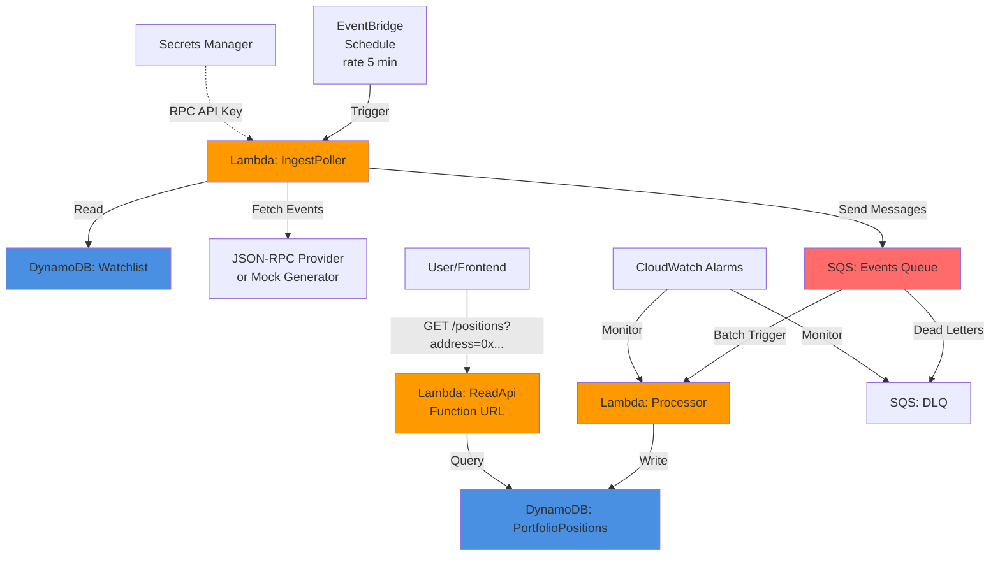

# DeFi Portfolio Tracker - Event-Driven Architecture on AWS

**[English](#english) | [Español](#español)**

---

## English

### Overview

A serverless, event-driven DeFi portfolio tracker built with AWS CDK (TypeScript). This MVP demonstrates how to poll blockchain events, process them asynchronously, and expose a read API—all within AWS Free Tier limits.

**Key Features:**
- ✅ **Free Tier Friendly**: DynamoDB provisioned tables (5 RCU/5 WCU), Lambda, SQS
- ✅ **No VPC/NAT/EC2**: Purely serverless, minimal cost
- ✅ **Event-Driven**: EventBridge schedule → Lambda poller → SQS → Lambda processor
- ✅ **Mock Mode**: Test without real blockchain RPC credentials
- ✅ **Lambda Function URL**: Simple HTTP API without API Gateway

### Architecture



### Components

| Resource | Type | Purpose |
|----------|------|---------|
| **PortfolioPositions** | DynamoDB Table | Stores user DeFi positions (PK: `user_address`, SK: `nft_id#EVENT_TYPE`) |
| **Watchlist** | DynamoDB Table | List of addresses to poll (PK: `user_address`) |
| **EventsQueue** | SQS Queue | Event buffer between poller and processor |
| **EventsDLQ** | SQS DLQ | Dead letter queue for failed processing |
| **IngestPoller** | Lambda (Node.js 20) | Fetches blockchain events every 5 minutes |
| **Processor** | Lambda (Node.js 20) | Idempotent event processor, writes to DynamoDB |
| **ReadApi** | Lambda (Node.js 20) | HTTP API to query positions via Function URL |
| **RpcApiKeySecret** | Secrets Manager | Stores JSON-RPC provider API key |

### Prerequisites

- **Node.js 20+** and npm
- **AWS CLI** configured with credentials
- **AWS CDK CLI**: `npm install -g aws-cdk`
- (Optional) Infura/Alchemy API key for real blockchain data

### Installation & Deployment

```bash
# 1. Clone the repository
git clone <your-repo-url>
cd DeFi-Portfolio-Tracker-event-drive

# 2. Install dependencies
npm install

# 3. Bootstrap CDK (first time only)
npx cdk bootstrap

# 4. Synthesize CloudFormation template
npm run synth

# 5. Deploy to AWS
npm run deploy
```

**Outputs:**
After deployment, you'll see:
- `ReadApiFunctionUrl`: HTTP endpoint for querying positions
- `WatchlistTableName`: DynamoDB table to add addresses
- `RpcSecretArn`: Secrets Manager secret ARN

### Configuration

#### Mock Mode (Default)

The system starts in **mock mode** (`USE_MOCK_EVENTS=true`), which generates random DeFi events for testing without requiring real blockchain RPC credentials.

#### Real Blockchain Mode

To switch to real blockchain polling:

1. **Get an RPC API key** from [Infura](https://infura.io/) or [Alchemy](https://www.alchemy.com/)

2. **Store the key in Secrets Manager:**
   ```bash
   aws secretsmanager put-secret-value \
     --secret-id defi-portfolio-tracker/rpc-api-key \
     --secret-string '{"apiKey":"YOUR_INFURA_OR_ALCHEMY_KEY"}'
   ```

3. **Update the stack** to set `USE_MOCK_EVENTS=false`:
   - Edit `lib/defi-portfolio-tracker-stack.ts`, change the environment variable in `IngestPoller`:
     ```typescript
     USE_MOCK_EVENTS: 'false',
     ```
   - Redeploy: `npm run deploy`

4. **Implement `fetchRealEvents()`** in `src/lambdas/ingest-poller/index.ts` (see inline comments for guidance)

### Usage

#### 1. Seed the Watchlist

Add Ethereum addresses you want to track:

```bash
aws dynamodb put-item \
  --table-name Watchlist \
  --item '{
    "user_address": {"S": "0x1234567890abcdef1234567890abcdef12345678"},
    "last_polled_block": {"N": "18000000"}
  }'
```

#### 2. Manually Trigger Poller (Optional)

Wait for the EventBridge schedule or invoke manually:

```bash
aws lambda invoke \
  --function-name defi-ingest-poller \
  --payload '{}' \
  response.json
```

#### 3. Query Positions

```bash
curl "https://<function-url>.lambda-url.us-east-1.on.aws/?address=0x1234567890abcdef1234567890abcdef12345678"
```

**Response:**
```json
{
  "address": "0x1234567890abcdef1234567890abcdef12345678",
  "positions": [
    {
      "user_address": "0x1234...",
      "nft_id_type": "1234#DEPOSIT",
      "nft_id": "1234",
      "event_type": "DEPOSIT",
      "amount": "42.5000",
      "token_address": "0xaaaa...",
      "block_number": 18000005,
      "transaction_hash": "0xabcd...",
      "timestamp": 1694567890000,
      "updated_at": 1694567890123
    }
  ],
  "count": 1,
  "timestamp": "2026-09-13T17:30:00.000Z"
}
```

### Free Tier Notes

- **DynamoDB**: 25 GB storage, 25 RCU, 25 WCU free (this stack uses 10 RCU + 10 WCU total)
- **Lambda**: 1M free requests/month, 400,000 GB-seconds compute
- **SQS**: 1M free requests/month
- **CloudWatch Logs**: 5 GB ingestion, 7-day retention
- **Secrets Manager**: First 30 days free for secrets, then $0.40/month per secret

**Cost Estimate**: ~$0.40-$1/month after Free Tier (primarily Secrets Manager)

### Monitoring & Alarms

The stack includes CloudWatch alarms:
- **ProcessorErrorsAlarm**: Triggers when Processor Lambda has errors
- **DLQDepthAlarm**: Triggers when messages appear in the dead letter queue

View alarms in the [CloudWatch Console](https://console.aws.amazon.com/cloudwatch/).

### Development

```bash
# Watch mode for TypeScript compilation
npm run watch

# View CloudFormation diff before deploy
npm run diff

# Destroy the stack
npm run destroy
```

### Testing Mock Events

With `USE_MOCK_EVENTS=true`, each poller invocation generates 0-3 random events per watchlist address. Check CloudWatch Logs:

```bash
aws logs tail /aws/lambda/defi-ingest-poller --follow
```

### Project Structure

```
DeFi-Portfolio-Tracker-event-drive/
├── bin/
│   └── app.ts                          # CDK app entry point
├── lib/
│   └── defi-portfolio-tracker-stack.ts # Main CDK stack
├── src/
│   └── lambdas/
│       ├── ingest-poller/
│       │   └── index.ts                # EventBridge → poll events → SQS
│       ├── processor/
│       │   └── index.ts                # SQS → process → DynamoDB
│       └── read-api/
│           └── index.ts                # Function URL → query DynamoDB
├── package.json
├── tsconfig.json
├── cdk.json
├── .gitignore
└── README.md
```

### Roadmap / Enhancements

- [ ] Frontend (React/Vue) to visualize portfolio
- [ ] Multi-chain support (Polygon, Arbitrum, etc.)
- [ ] WebSocket listener for real-time events
- [ ] Cognito authentication for read API
- [ ] Uniswap/DeFi protocol integrations
- [ ] CI/CD pipeline (GitHub Actions)

### Resources & Inspiration

This project was inspired by AWS architecture best practices:
- [Implementing an Event-Driven DeFi Portfolio Tracker on AWS](https://aws.amazon.com/blogs/web3/implementing-an-event-driven-defi-portfolio-tracker-on-aws/)
- [Processing Digital Asset Payments on AWS](https://aws.amazon.com/blogs/web3/processing-digital-asset-payments-on-aws/)

### License

MIT License - see [LICENSE](LICENSE) file for details.

---

## Español

### Descripción General

Un rastreador de portafolio DeFi serverless y orientado a eventos, construido con AWS CDK (TypeScript). Este MVP demuestra cómo hacer polling de eventos blockchain, procesarlos de forma asíncrona y exponer una API de lectura—todo dentro de los límites del Free Tier de AWS.

**Características Clave:**
- ✅ **Compatible con Free Tier**: Tablas DynamoDB provisionadas (5 RCU/5 WCU), Lambda, SQS
- ✅ **Sin VPC/NAT/EC2**: Completamente serverless, costo mínimo
- ✅ **Orientado a Eventos**: Programación EventBridge → Lambda poller → SQS → Lambda processor
- ✅ **Modo Mock**: Prueba sin credenciales RPC reales de blockchain
- ✅ **Lambda Function URL**: API HTTP simple sin API Gateway

### Arquitectura

*(Ver diagrama en la sección inglesa arriba)*

### Componentes

| Recurso | Tipo | Propósito |
|---------|------|-----------|
| **PortfolioPositions** | Tabla DynamoDB | Almacena posiciones DeFi de usuarios (PK: `user_address`, SK: `nft_id#EVENT_TYPE`) |
| **Watchlist** | Tabla DynamoDB | Lista de direcciones a monitorear (PK: `user_address`) |
| **EventsQueue** | Cola SQS | Buffer de eventos entre poller y processor |
| **EventsDLQ** | DLQ SQS | Cola de mensajes fallidos |
| **IngestPoller** | Lambda (Node.js 20) | Obtiene eventos blockchain cada 5 minutos |
| **Processor** | Lambda (Node.js 20) | Procesador idempotente de eventos, escribe en DynamoDB |
| **ReadApi** | Lambda (Node.js 20) | API HTTP para consultar posiciones vía Function URL |
| **RpcApiKeySecret** | Secrets Manager | Almacena la API key del proveedor JSON-RPC |

### Requisitos Previos

- **Node.js 20+** y npm
- **AWS CLI** configurado con credenciales
- **AWS CDK CLI**: `npm install -g aws-cdk`
- (Opcional) API key de Infura/Alchemy para datos blockchain reales

### Instalación y Despliegue

```bash
# 1. Clonar el repositorio
git clone <url-de-tu-repo>
cd DeFi-Portfolio-Tracker-event-drive

# 2. Instalar dependencias
npm install

# 3. Inicializar CDK (solo la primera vez)
npx cdk bootstrap

# 4. Sintetizar plantilla CloudFormation
npm run synth

# 5. Desplegar en AWS
npm run deploy
```

**Salidas:**
Después del despliegue, verás:
- `ReadApiFunctionUrl`: Endpoint HTTP para consultar posiciones
- `WatchlistTableName`: Tabla DynamoDB para agregar direcciones
- `RpcSecretArn`: ARN del secreto en Secrets Manager

### Configuración

#### Modo Mock (Por Defecto)

El sistema inicia en **modo mock** (`USE_MOCK_EVENTS=true`), que genera eventos DeFi aleatorios para pruebas sin requerir credenciales RPC reales.

#### Modo Blockchain Real

Para cambiar a polling blockchain real:

1. **Obtén una API key RPC** de [Infura](https://infura.io/) o [Alchemy](https://www.alchemy.com/)

2. **Almacena la clave en Secrets Manager:**
   ```bash
   aws secretsmanager put-secret-value \
     --secret-id defi-portfolio-tracker/rpc-api-key \
     --secret-string '{"apiKey":"TU_CLAVE_INFURA_O_ALCHEMY"}'
   ```

3. **Actualiza el stack** para establecer `USE_MOCK_EVENTS=false`:
   - Edita `lib/defi-portfolio-tracker-stack.ts`, cambia la variable de entorno en `IngestPoller`:
     ```typescript
     USE_MOCK_EVENTS: 'false',
     ```
   - Redesplegar: `npm run deploy`

4. **Implementa `fetchRealEvents()`** en `src/lambdas/ingest-poller/index.ts` (ver comentarios en línea)

### Uso

#### 1. Inicializar la Watchlist

Agrega direcciones de Ethereum que quieras rastrear:

```bash
aws dynamodb put-item \
  --table-name Watchlist \
  --item '{
    "user_address": {"S": "0x1234567890abcdef1234567890abcdef12345678"},
    "last_polled_block": {"N": "18000000"}
  }'
```

#### 2. Invocar Manualmente el Poller (Opcional)

Espera la programación de EventBridge o invoca manualmente:

```bash
aws lambda invoke \
  --function-name defi-ingest-poller \
  --payload '{}' \
  response.json
```

#### 3. Consultar Posiciones

```bash
curl "https://<function-url>.lambda-url.us-east-1.on.aws/?address=0x1234567890abcdef1234567890abcdef12345678"
```

**Respuesta:**
```json
{
  "address": "0x1234567890abcdef1234567890abcdef12345678",
  "positions": [
    {
      "user_address": "0x1234...",
      "nft_id_type": "1234#DEPOSIT",
      "nft_id": "1234",
      "event_type": "DEPOSIT",
      "amount": "42.5000",
      "token_address": "0xaaaa...",
      "block_number": 18000005,
      "transaction_hash": "0xabcd...",
      "timestamp": 1694567890000,
      "updated_at": 1694567890123
    }
  ],
  "count": 1,
  "timestamp": "2026-09-13T17:30:00.000Z"
}
```

### Notas sobre Free Tier

- **DynamoDB**: 25 GB almacenamiento, 25 RCU, 25 WCU gratis (este stack usa 10 RCU + 10 WCU total)
- **Lambda**: 1M solicitudes gratis/mes, 400,000 GB-segundos de cómputo
- **SQS**: 1M solicitudes gratis/mes
- **CloudWatch Logs**: 5 GB ingesta, retención de 7 días
- **Secrets Manager**: Primeros 30 días gratis para secretos, luego $0.40/mes por secreto

**Estimación de Costo**: ~$0.40-$1/mes después del Free Tier (principalmente Secrets Manager)

### Monitoreo y Alarmas

El stack incluye alarmas de CloudWatch:
- **ProcessorErrorsAlarm**: Se activa cuando el Lambda Processor tiene errores
- **DLQDepthAlarm**: Se activa cuando aparecen mensajes en la cola de dead letters

Ver alarmas en la [Consola de CloudWatch](https://console.aws.amazon.com/cloudwatch/).

### Desarrollo

```bash
# Modo observación para compilación TypeScript
npm run watch

# Ver diff de CloudFormation antes de desplegar
npm run diff

# Destruir el stack
npm run destroy
```

### Prueba de Eventos Mock

Con `USE_MOCK_EVENTS=true`, cada invocación del poller genera 0-3 eventos aleatorios por dirección en watchlist. Revisa CloudWatch Logs:

```bash
aws logs tail /aws/lambda/defi-ingest-poller --follow
```

### Estructura del Proyecto

```
DeFi-Portfolio-Tracker-event-drive/
├── bin/
│   └── app.ts                          # Punto de entrada de la app CDK
├── lib/
│   └── defi-portfolio-tracker-stack.ts # Stack CDK principal
├── src/
│   └── lambdas/
│       ├── ingest-poller/
│       │   └── index.ts                # EventBridge → polling eventos → SQS
│       ├── processor/
│       │   └── index.ts                # SQS → procesar → DynamoDB
│       └── read-api/
│           └── index.ts                # Function URL → consultar DynamoDB
├── package.json
├── tsconfig.json
├── cdk.json
├── .gitignore
└── README.md
```

### Hoja de Ruta / Mejoras

- [ ] Frontend (React/Vue) para visualizar portafolio
- [ ] Soporte multi-cadena (Polygon, Arbitrum, etc.)
- [ ] Listener WebSocket para eventos en tiempo real
- [ ] Autenticación Cognito para read API
- [ ] Integraciones de protocolos Uniswap/DeFi
- [ ] Pipeline CI/CD (GitHub Actions)

### Recursos e Inspiración

Este proyecto fue inspirado por las mejores prácticas de arquitectura de AWS:
- [Implementing an Event-Driven DeFi Portfolio Tracker on AWS](https://aws.amazon.com/blogs/web3/implementing-an-event-driven-defi-portfolio-tracker-on-aws/)
- [Processing Digital Asset Payments on AWS](https://aws.amazon.com/blogs/web3/processing-digital-asset-payments-on-aws/)

### Licencia

Licencia MIT - ver archivo [LICENSE](LICENSE) para detalles.
