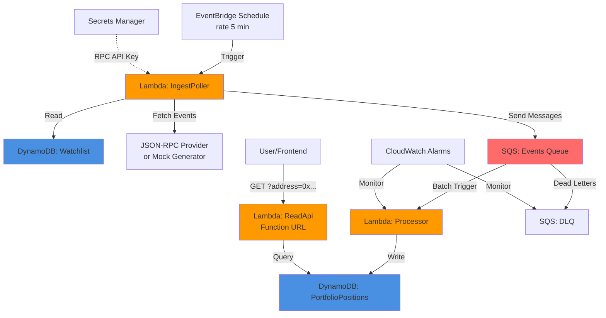

# DeFi Portfolio Tracker - Event-Driven Architecture

**[English](#english) | [Español](#español)**

---

## English

### Overview

A serverless, event-driven DeFi portfolio tracker that polls blockchain events for watched wallets, processes them asynchronously, and exposes a read API. Supports **both local development** (with AWS emulators) and **AWS deployment** (CDK, Free Tier optimized).

**Key Features:**
- ✅ **Local Development**: DynamoDB Local + ElasticMQ (SQS emulator) - no AWS account needed
- ✅ **AWS Deployment**: CDK infrastructure, Free Tier friendly (provisioned DynamoDB 5 RCU/5 WCU)
- ✅ **Event-Driven**: Scheduled poller → SQS → processor → DynamoDB
- ✅ **Mock Mode**: Deterministic mock events for testing without real blockchain RPC
- ✅ **Dual APIs**: Express server (local) or Lambda Function URL (AWS)
- ✅ **No VPC/NAT/EC2**: Purely serverless, minimal cost

### Architecture



### Components

| Resource | Type | Purpose |
|----------|------|---------|
| **PortfolioPositions** | DynamoDB Table | Stores user DeFi positions (PK: `user_address`, SK: `nft_id#EVENT_TYPE`) |
| **Watchlist** | DynamoDB Table | List of addresses to poll (PK: `user_address`) |
| **EventsQueue** | SQS Queue | Event buffer between poller and processor |
| **EventsDLQ** | SQS DLQ | Dead letter queue for failed processing |
| **IngestPoller** | Lambda (Node.js 20) | Fetches blockchain events every 5 minutes, updates `last_polled_block` |
| **Processor** | Lambda (Node.js 20) | Idempotent event processor with partial batch failure support |
| **ReadApi** | Lambda (Node.js 20) | HTTP API (Function URL) with address validation |
| **RpcApiKeySecret** | Secrets Manager | Stores JSON-RPC provider API key (optional, for real blockchain data) |

---

## Local Development (No AWS Required)

### Prerequisites

- **Node.js ≥ 20** (tested with Node 22)
- **Java ≥ 11** (for DynamoDB Local and ElasticMQ)

### Quick Start

```bash
# 1. Install dependencies and download AWS emulators
bash scripts/install.sh

# 2. Start emulators in separate terminals
bash scripts/start-dynamodb.sh     # DynamoDB Local on :8000
bash scripts/start-elasticmq.sh    # ElasticMQ (SQS) on :9324

# 3. Start the app stack (API + worker + cron)
npm run dev
```

**In Cloud Agents**, this is automatic: `install.sh` runs during the `install` phase, and emulators + app start via `.cursor/environment.json`.

### Local Testing

```bash
# End-to-end test: poll → queue → process → query
npm run e2e

# Query the local API
curl localhost:3000/health
curl localhost:3000/wallets
curl localhost:3000/wallets/0xaaaaaaaaaaaaaaaaaaaaaaaaaaaaaaaaaaaaaaaa/events
curl localhost:3000/wallets/<address>/portfolio

# Run unit tests
npm test
```

### Local Configuration

All variables have defaults for local development. Copy `.env.example` to `.env` only if you want to override.

| Variable | Default | Description |
|----------|---------|-------------|
| `RPC_MODE` | `mock` | `mock` (deterministic synthetic events, offline) or `http` (real JSON-RPC) |
| `RPC_URL` | `https://cloudflare-eth.com` | JSON-RPC endpoint when `RPC_MODE=http` |
| `WATCHED_WALLETS` | 2 example wallets | Comma-separated `0x` addresses |
| `DYNAMODB_ENDPOINT` | `http://127.0.0.1:8000` | Empty for real AWS |
| `SQS_ENDPOINT` | `http://127.0.0.1:9324` | Empty for real AWS |
| `TABLE_NAME` | `DefiEvents` | DynamoDB table name |
| `QUEUE_NAME` | `defi-events` | SQS queue name |
| `API_PORT` | `3000` | Local API port |
| `POLL_INTERVAL_MS` | `15000` | Local cron frequency |

---

## AWS Deployment (CDK)

### Prerequisites

- **AWS CLI** configured with credentials
- **AWS CDK CLI**: `npm install -g aws-cdk`
- (Optional) Infura/Alchemy API key for real blockchain data

### Deploy to AWS

```bash
# 1. Install dependencies
npm install

# 2. Bootstrap CDK (first time only)
npx cdk bootstrap

# 3. Synthesize CloudFormation template
npm run synth

# 4. Deploy to AWS
npm run deploy
```

**Outputs** (after deployment):
- `ReadApiFunctionUrl`: HTTP endpoint for querying positions
- `WatchlistTableName`: DynamoDB table (add addresses here)
- `RpcSecretArn`: Secrets Manager secret ARN

### CDK Infrastructure Location

CDK files are in `infra/cdk/`:
- `infra/cdk/bin/app.ts` - CDK app entry point
- `infra/cdk/lib/defi-portfolio-tracker-stack.ts` - Main stack
- `infra/cdk/src/` - Lambda handler wrappers (isolated from main app code)

The **serverless app code** (`src/handlers/`, `src/lib/`) is the source of truth for domain logic. CDK Lambdas in `infra/cdk/src/` are independent wrappers optimized for AWS deployment.

### AWS Configuration

#### Mock Mode (Default)

The system starts in **mock mode** (`USE_MOCK_EVENTS=true`). Mock events are **deterministic** - each address gets 3 fixed NFT positions to prevent infinite DynamoDB growth.

#### Real Blockchain Mode

1. Get an RPC API key from [Infura](https://infura.io/) or [Alchemy](https://www.alchemy.com/)

2. Store the key in Secrets Manager:
   ```bash
   aws secretsmanager put-secret-value \
     --secret-id defi-portfolio-tracker/rpc-api-key \
     --secret-string '{"apiKey":"YOUR_KEY"}'
   ```

3. Update the stack environment variable in `infra/cdk/lib/defi-portfolio-tracker-stack.ts`:
   ```typescript
   USE_MOCK_EVENTS: 'false',
   ```

4. Redeploy: `npm run deploy`

### Seed the Watchlist (AWS)

```bash
aws dynamodb put-item \
  --table-name Watchlist \
  --item '{
    "user_address": {"S": "0x1234567890abcdef1234567890abcdef12345678"},
    "last_polled_block": {"N": "18000000"}
  }'
```

### Query Positions (AWS)

```bash
curl "https://<function-url>.lambda-url.us-east-1.on.aws/?address=0x1234567890abcdef1234567890abcdef12345678"
```

**Response:**
```json
{
  "address": "0x1234...",
  "positions": [...],
  "count": 3,
  "timestamp": "2026-09-13T18:30:00.000Z"
}
```

### Security Notes

⚠️ **Function URL Auth**: Currently set to `NONE` (public). For production:
- Consider using `AWS_IAM` auth type
- Add API Gateway with Cognito/JWT authentication
- The ReadApi validates Ethereum address format to prevent injection attacks

### Free Tier Cost Breakdown

| Service | Free Tier | This Stack (AWS) | Monthly Cost |
|---------|-----------|------------------|--------------|
| **DynamoDB** | 25 GB, 25 RCU/WCU | 10 RCU/WCU total (2 tables) | Free |
| **Lambda** | 1M requests, 400K GB-seconds | ~8,640 invocations/month (5-min polling) | Free |
| **SQS** | 1M requests | Well within limit | Free |
| **CloudWatch Logs** | 5 GB ingestion | 7-day retention | Free |
| **Secrets Manager** | First 30 days free | 1 secret | **$0.40/month** after trial |

**Estimated Cost**: **$0.40-$1/month** (primarily Secrets Manager)

**Alternative**: Use **AWS Systems Manager Parameter Store (SecureString)** instead of Secrets Manager for **free** RPC key storage (up to 10K parameters free).

---

## Scripts

| Command | What it does |
|---------|--------------|
| **Local Dev** ||
| `npm run build` | Compile TypeScript to `dist/` |
| `npm test` | Unit tests (normalization, portfolio, mock generator) |
| `npm run bootstrap` | Create table/queue in local emulators |
| `npm run dev` | Full local stack (API + worker + cron) |
| `npm run poll` | Run poller once |
| `npm run e2e` | End-to-end pipeline test |
| `npm run api` | Start API server only |
| `npm run worker` | Start SQS worker only |
| **AWS CDK** ||
| `npm run build:cdk` | Compile CDK TypeScript |
| `npm run synth` | Synthesize CloudFormation |
| `npm run deploy` | Deploy to AWS |
| `npm run diff` | View pending changes |
| `npm run destroy` | Destroy the stack |

---

## Project Structure

```
DeFi-Portfolio-Tracker-event-drive/
├── src/                          # Main application code (local + serverless)
│   ├── handlers/                 # Lambda/Express handlers
│   │   ├── poller.ts            # Polls RPC for events
│   │   ├── normalizer.ts        # Processes SQS events
│   │   ├── api.ts               # Express API logic
│   │   └── api-lambda.ts        # API Gateway wrapper
│   ├── lib/                      # Shared libraries
│   │   ├── aws.ts               # DynamoDB + SQS clients
│   │   ├── rpc.ts               # Mock + real RPC sources
│   │   ├── store.ts             # DynamoDB operations
│   │   └── queue.ts             # SQS operations
│   ├── domain/                   # Business logic
│   │   └── events.ts            # Event types & portfolio calc
│   ├── local/                    # Local dev scripts
│   │   ├── dev.ts               # Orchestrates local stack
│   │   ├── bootstrap.ts         # Sets up local tables/queues
│   │   └── e2e.ts               # End-to-end test
│   └── config.ts                # Environment configuration
├── infra/cdk/                    # AWS CDK infrastructure (isolated)
│   ├── bin/app.ts               # CDK app entry
│   ├── lib/                      # CDK stack definitions
│   │   └── defi-portfolio-tracker-stack.ts
│   ├── src/                      # CDK Lambda wrappers
│   │   ├── ingest-poller/       # Deterministic mock generator
│   │   ├── processor/           # Partial batch failure support
│   │   └── read-api/            # Address validation
│   └── tsconfig.json            # CDK TypeScript config
├── scripts/                      # Setup & emulator scripts
│   ├── install.sh               # Downloads emulators
│   ├── start-dynamodb.sh        # Starts DynamoDB Local
│   └── start-elasticmq.sh       # Starts ElasticMQ (SQS)
├── serverless.yml               # Serverless Framework config (optional)
├── package.json                 # Combined scripts (local + CDK)
└── README.md                    # This file
```

---

## Key Differences: Local vs AWS CDK

| Feature | Local Development | AWS CDK Deployment |
|---------|------------------|-------------------|
| **Database** | DynamoDB Local (:8000) | DynamoDB (provisioned) |
| **Queue** | ElasticMQ (:9324) | SQS + DLQ |
| **Poller** | Node cron (`setInterval`) | EventBridge (5-min schedule) |
| **API** | Express server (:3000) | Lambda Function URL |
| **Secrets** | `.env` file | Secrets Manager / SSM |
| **Monitoring** | Console logs | CloudWatch Logs + Alarms |
| **Cost** | Free (local CPU/memory) | ~$0.40-$1/month |

Both use the same domain logic in `src/domain/` and `src/lib/`.

---

## Monitoring & Alarms (AWS)

CloudWatch alarms included:
- **ProcessorErrorsAlarm**: Triggers on Lambda errors
- **DLQDepthAlarm**: Triggers when messages appear in DLQ

View in [CloudWatch Console](https://console.aws.amazon.com/cloudwatch/).

---

## Roadmap / Enhancements

- [ ] Frontend (React/Vue) to visualize portfolio
- [ ] Multi-chain support (Polygon, Arbitrum, etc.)
- [ ] WebSocket listener for real-time events
- [ ] Cognito authentication for API
- [ ] Full Uniswap/Aave/Compound protocol integrations
- [ ] CI/CD pipeline (GitHub Actions)
- [ ] Terraform alternative to CDK

---

## Resources & Inspiration

This project was inspired by AWS architecture best practices:
- [Implementing an Event-Driven DeFi Portfolio Tracker on AWS](https://aws.amazon.com/blogs/web3/implementing-an-event-driven-defi-portfolio-tracker-on-aws/)
- [Processing Digital Asset Payments on AWS](https://aws.amazon.com/blogs/web3/processing-digital-asset-payments-on-aws/)

---

## License

MIT License - see [LICENSE](LICENSE) file for details.

---

## Español

### Descripción General

Un rastreador de portafolio DeFi serverless y orientado a eventos que hace polling de eventos blockchain para wallets vigiladas, los procesa de forma asíncrona y expone una API de lectura. Soporta **desarrollo local** (con emuladores de AWS) y **despliegue en AWS** (CDK, optimizado para Free Tier).

**Características Clave:**
- ✅ **Desarrollo Local**: DynamoDB Local + ElasticMQ (emulador SQS) - sin cuenta de AWS
- ✅ **Despliegue AWS**: Infraestructura CDK, compatible con Free Tier (DynamoDB provisionado 5 RCU/5 WCU)
- ✅ **Orientado a Eventos**: Poller programado → SQS → procesador → DynamoDB
- ✅ **Modo Mock**: Eventos mock deterministas para pruebas sin RPC blockchain real
- ✅ **APIs Duales**: Servidor Express (local) o Lambda Function URL (AWS)
- ✅ **Sin VPC/NAT/EC2**: Completamente serverless, costo mínimo

### Arquitectura

*(Ver diagrama en sección inglesa arriba)*

### Componentes

*(Ver tabla de componentes en sección inglesa arriba)*

---

## Desarrollo Local (Sin AWS)

### Requisitos

- **Node.js ≥ 20** (probado con Node 22)
- **Java ≥ 11** (para DynamoDB Local y ElasticMQ)

### Inicio Rápido

```bash
# 1. Instalar dependencias y descargar emuladores AWS
bash scripts/install.sh

# 2. Iniciar emuladores en terminales separadas
bash scripts/start-dynamodb.sh     # DynamoDB Local en :8000
bash scripts/start-elasticmq.sh    # ElasticMQ (SQS) en :9324

# 3. Iniciar el stack de la app (API + worker + cron)
npm run dev
```

### Pruebas Locales

```bash
# Prueba de punta a punta: poll → cola → procesar → consultar
npm run e2e

# Consultar la API local
curl localhost:3000/health
curl localhost:3000/wallets
curl localhost:3000/wallets/<direccion>/events
curl localhost:3000/wallets/<direccion>/portfolio

# Tests unitarios
npm test
```

---

## Despliegue en AWS (CDK)

### Requisitos

- **AWS CLI** configurado con credenciales
- **AWS CDK CLI**: `npm install -g aws-cdk`
- (Opcional) API key de Infura/Alchemy para datos blockchain reales

### Desplegar en AWS

```bash
# 1. Instalar dependencias
npm install

# 2. Inicializar CDK (solo la primera vez)
npx cdk bootstrap

# 3. Sintetizar plantilla CloudFormation
npm run synth

# 4. Desplegar en AWS
npm run deploy
```

**Salidas** (después del despliegue):
- `ReadApiFunctionUrl`: Endpoint HTTP para consultar posiciones
- `WatchlistTableName`: Tabla DynamoDB (agregar direcciones aquí)
- `RpcSecretArn`: ARN del secreto en Secrets Manager

### Ubicación de Infraestructura CDK

Los archivos CDK están en `infra/cdk/`:
- `infra/cdk/bin/app.ts` - Punto de entrada CDK
- `infra/cdk/lib/defi-portfolio-tracker-stack.ts` - Stack principal
- `infra/cdk/src/` - Wrappers Lambda (aislados del código principal)

El **código de la app serverless** (`src/handlers/`, `src/lib/`) es la fuente de verdad para la lógica de dominio. Los Lambdas CDK en `infra/cdk/src/` son wrappers independientes optimizados para despliegue AWS.

### Configuración AWS

#### Modo Mock (Por Defecto)

El sistema inicia en **modo mock** (`USE_MOCK_EVENTS=true`). Los eventos mock son **deterministas** - cada dirección obtiene 3 posiciones NFT fijas para evitar crecimiento infinito en DynamoDB.

#### Modo Blockchain Real

1. Obtener API key de [Infura](https://infura.io/) o [Alchemy](https://www.alchemy.com/)

2. Almacenar la clave en Secrets Manager:
   ```bash
   aws secretsmanager put-secret-value \
     --secret-id defi-portfolio-tracker/rpc-api-key \
     --secret-string '{"apiKey":"TU_CLAVE"}'
   ```

3. Actualizar variable de entorno en `infra/cdk/lib/defi-portfolio-tracker-stack.ts`:
   ```typescript
   USE_MOCK_EVENTS: 'false',
   ```

4. Redesplegar: `npm run deploy`

### Notas de Seguridad

⚠️ **Auth de Function URL**: Actualmente en `NONE` (público). Para producción:
- Considerar usar tipo de auth `AWS_IAM`
- Agregar API Gateway con autenticación Cognito/JWT
- ReadApi valida formato de dirección Ethereum para prevenir ataques de inyección

### Desglose de Costos Free Tier

*(Ver tabla de costos en sección inglesa arriba)*

**Costo Estimado**: **$0.40-$1/mes** (principalmente Secrets Manager)

**Alternativa**: Usar **AWS Systems Manager Parameter Store (SecureString)** en lugar de Secrets Manager para almacenamiento **gratuito** de clave RPC (hasta 10K parámetros gratis).

---

## Scripts

*(Ver tabla de scripts en sección inglesa arriba)*

---

## Diferencias Clave: Local vs AWS CDK

*(Ver tabla comparativa en sección inglesa arriba)*

---

## Hoja de Ruta

*(Ver lista de mejoras futuras en sección inglesa arriba)*

---

## Recursos e Inspiración

*(Ver enlaces en sección inglesa arriba)*

---

## Licencia

Licencia MIT - ver archivo [LICENSE](LICENSE) para detalles.
